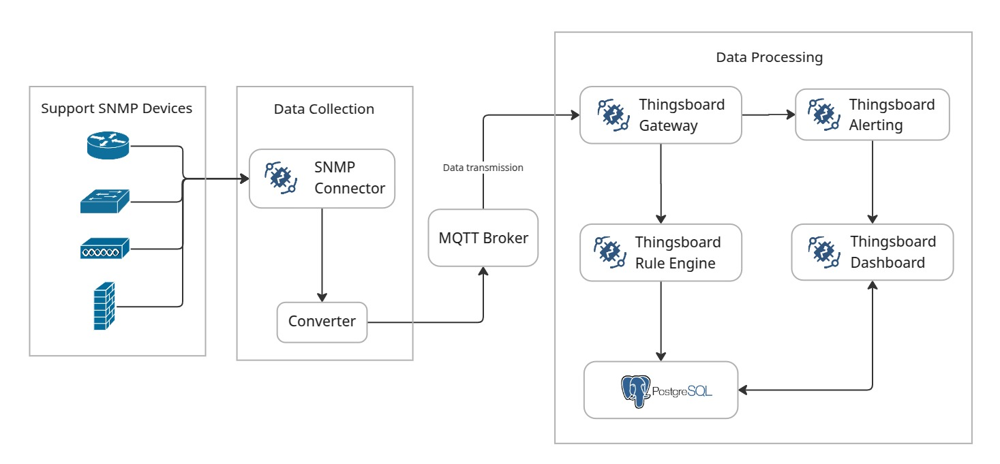

# Network Device Monitoring System Using ThingsBoard

This repository contains the development of a **Network Device Monitoring System** leveraging the **ThingsBoard IoT platform**. The system is designed to monitor and manage network devices (such as routers, switches, and servers) in real-time using the **SNMP (Simple Network Management Protocol)** protocol. The project integrates ThingsBoard's powerful IoT capabilities with custom gateway configurations to collect, visualize, and analyze network performance metrics.

## Key Features

1. **Real-Time Monitoring**:

   - Collects real-time data from network devices using SNMP, including CPU usage, memory utilization, bandwidth, and interface status.
   - Provides live dashboards for visualizing network health and performance.

2. **ThingsBoard Integration**:

   - Utilizes ThingsBoard as the central IoT platform for data storage, processing, and visualization.
   - Custom dashboards and widgets are created to display network metrics in an intuitive and user-friendly manner.

3. **Custom SNMP Gateway**:

   - A custom **ThingsBoard Gateway** is implemented to bridge SNMP-enabled devices with the ThingsBoard platform.
   - Supports multiple SNMP devices and allows for easy configuration through JSON files.

4. **Alerting and Notifications**:

   - Configurable alerts are set up to notify administrators of critical events, such as high CPU usage, link failures, or unusual traffic patterns.
   - Notifications can be sent via email, SMS, or other integrated messaging platforms.

5. **Scalable and Modular Architecture**:

   - The system is designed to be scalable, allowing for the addition of new devices and metrics with minimal configuration.
   - Docker containers are used for easy deployment and management of the ThingsBoard server, gateway, and database.

6. **Data Visualization**:
   - Interactive dashboards provide insights into network performance trends, device status, and historical data.
   - Customizable widgets allow users to tailor the monitoring experience to their specific needs.

## Technologies Used

- **ThingsBoard**: Open-source IoT platform for data collection, processing, and visualization.
- **SNMP**: Protocol used for monitoring and managing network devices.
- **Docker**: Containerization for easy deployment and scalability.

## Architecture

   

The network device monitoring system will be built with the design as in the diagram. There are several processes starting from data collection to visualization on the dashboard. Based on the system design that has been designed, this monitoring system has the following architecture:

##### Telemetry Process

The process of collecting data from various network devices (routers, switches, firewalls, servers, and other devices) that have been configured with the SNMP protocol using SNMP Connector as a component in charge of polling data periodically from these devices. The data that has been obtained will then be translated using Converter to transform SNMP data (such as OID) into JSON format that can be processed by ThingsBoard.

##### Data Transmission

The process of sending data that has been converted via the MQTT protocol using the MQTT Broker as a communication intermediary between the telemetry process and the data processing system.

##### Data Processing

In the data processing stage, the ThingsBoard Gateway functions as a bridge between network devices and the ThingsBoard platform. The data obtained will then be validated using the ThingsBoard Rule Engine to detect anomalies. Furthermore, the data that has been processed will be stored in the PostgreSQL database.

##### Visualization & Alerting

By utilizing Thingsboard Dashboard, this monitoring system also provides a dashboard that makes it easy for administrators to monitor the condition of network devices. Every anomaly detected by the Rule Engine, the system will send a notification on the dashboard so that the administrator can take immediate action.
